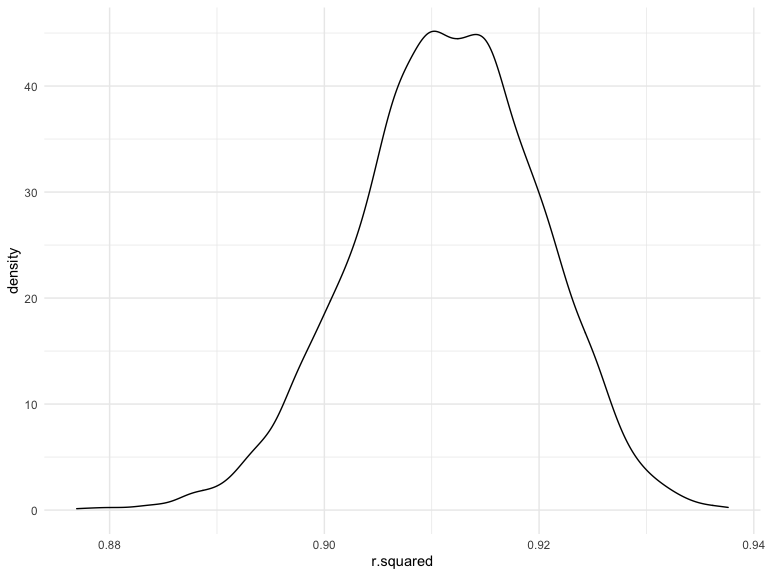
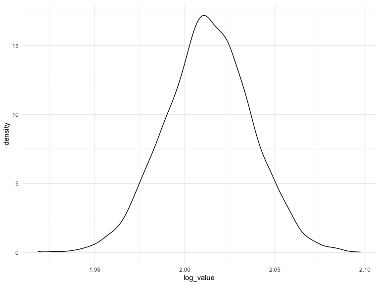

p8105\_hw6\_sl5009
================
Shengzhi Luo
03/12/2021

# Problem 1

## Load and clean the data

``` r
birthweight_df=
  read_csv("./birthweight.csv") %>% 
  mutate(
    babysex=case_when(
      babysex=="1" ~ "male",
      babysex=="2" ~ "female"
    ),
    frace=case_when(
      frace=="1" ~ "White",
      frace=="2" ~ "Black",
      frace=="3" ~ "Asian",
      frace=="4" ~ "Puerto Rican",
      frace=="8" ~ "Other",
      frace=="9" ~ "Unknown"
    ),
    malform=case_when(
      malform=="0" ~"absent",
      malform=="1" ~ "present"
    ),
    mrace=case_when(
      mrace=="1" ~ "White",
      mrace=="2" ~ "Black",
      mrace=="3" ~ "Asian",
      mrace=="4" ~ "Puerto Rican",
      mrace=="8" ~ "Other"
    ),
    babysex=fct_infreq(babysex)
  ) %>% 
  replace(is.na(.), 0) %>% 
  select(-pnumlbw,-pnumsga)
```

    ## Rows: 4342 Columns: 20

    ## ── Column specification ────────────────────────────────────────────────────────
    ## Delimiter: ","
    ## dbl (20): babysex, bhead, blength, bwt, delwt, fincome, frace, gaweeks, malf...

    ## 
    ## ℹ Use `spec()` to retrieve the full column specification for this data.
    ## ℹ Specify the column types or set `show_col_types = FALSE` to quiet this message.

We make babysex, frace, malform and mrace as factors and drop pnumlbw
and pnumsga column since they are all 0.

## Propose a regression model for birthweight.

``` r
fit_0 = lm(bwt ~ ., data = birthweight_df)
summary(fit_0)
```

    ## 
    ## Call:
    ## lm(formula = bwt ~ ., data = birthweight_df)
    ## 
    ## Residuals:
    ##      Min       1Q   Median       3Q      Max 
    ## -1097.68  -184.86    -3.33   173.09  2344.15 
    ## 
    ## Coefficients: (1 not defined because of singularities)
    ##                     Estimate Std. Error t value Pr(>|t|)    
    ## (Intercept)       -6335.5419   659.4669  -9.607  < 2e-16 ***
    ## babysexfemale        28.7073     8.4652   3.391 0.000702 ***
    ## bhead               130.7781     3.4523  37.881  < 2e-16 ***
    ## blength              74.9536     2.0217  37.075  < 2e-16 ***
    ## delwt                 4.1007     0.3948  10.386  < 2e-16 ***
    ## fincome               0.2898     0.1795   1.614 0.106551    
    ## fraceBlack           -6.9048    78.8349  -0.088 0.930210    
    ## fraceOther          -16.9392    97.5932  -0.174 0.862212    
    ## fracePuerto Rican   -68.2323    78.4692  -0.870 0.384599    
    ## fraceWhite          -21.2361    69.2960  -0.306 0.759273    
    ## gaweeks              11.5494     1.4654   7.882 4.06e-15 ***
    ## malformpresent        9.7650    70.6259   0.138 0.890039    
    ## menarche             -3.5508     2.8951  -1.226 0.220083    
    ## mheight               9.7874    10.3116   0.949 0.342588    
    ## momage                0.7593     1.2221   0.621 0.534418    
    ## mraceBlack          -60.0488    80.9532  -0.742 0.458266    
    ## mracePuerto Rican    34.9079    80.9481   0.431 0.666317    
    ## mraceWhite           91.3866    71.9190   1.271 0.203908    
    ## parity               95.5411    40.4793   2.360 0.018307 *  
    ## ppbmi                 4.3538    14.8913   0.292 0.770017    
    ## ppwt                 -3.4716     2.6121  -1.329 0.183913    
    ## smoken               -4.8544     0.5871  -8.269  < 2e-16 ***
    ## wtgain                    NA         NA      NA       NA    
    ## ---
    ## Signif. codes:  0 '***' 0.001 '**' 0.01 '*' 0.05 '.' 0.1 ' ' 1
    ## 
    ## Residual standard error: 272.5 on 4320 degrees of freedom
    ## Multiple R-squared:  0.7183, Adjusted R-squared:  0.717 
    ## F-statistic: 524.6 on 21 and 4320 DF,  p-value: < 2.2e-16

``` r
fit_1 = lm(bwt ~ delwt + menarche + fincome + mheight + momage + mrace + smoken + wtgain + parity, data = birthweight_df)
summary(fit_1)
```

    ## 
    ## Call:
    ## lm(formula = bwt ~ delwt + menarche + fincome + mheight + momage + 
    ##     mrace + smoken + wtgain + parity, data = birthweight_df)
    ## 
    ## Residuals:
    ##      Min       1Q   Median       3Q      Max 
    ## -2321.11  -253.72    19.88   296.77  1490.11 
    ## 
    ## Coefficients:
    ##                    Estimate Std. Error t value Pr(>|t|)    
    ## (Intercept)       1342.1583   192.0008   6.990 3.16e-12 ***
    ## delwt                4.3281     0.3864  11.202  < 2e-16 ***
    ## menarche            -4.4493     4.7870  -0.929 0.352707    
    ## fincome              0.4333     0.2963   1.462 0.143707    
    ## mheight             16.8977     2.9679   5.693 1.33e-08 ***
    ## momage               3.4912     2.0164   1.731 0.083457 .  
    ## mraceBlack        -265.1003    71.3285  -3.717 0.000204 ***
    ## mracePuerto Rican  -67.5719    75.8818  -0.890 0.373253    
    ## mraceWhite          67.9757    70.7521   0.961 0.336727    
    ## smoken             -12.1012     0.9580 -12.632  < 2e-16 ***
    ## wtgain               7.7877     0.7085  10.991  < 2e-16 ***
    ## parity             -31.1449    66.7382  -0.467 0.640757    
    ## ---
    ## Signif. codes:  0 '***' 0.001 '**' 0.01 '*' 0.05 '.' 0.1 ' ' 1
    ## 
    ## Residual standard error: 451.2 on 4330 degrees of freedom
    ## Multiple R-squared:  0.226,  Adjusted R-squared:  0.224 
    ## F-statistic: 114.9 on 11 and 4330 DF,  p-value: < 2.2e-16

``` r
fit_2 = lm(bwt ~ delwt + menarche + fincome + mheight + momage + mrace + smoken + wtgain, data = birthweight_df)
summary(fit_2)
```

    ## 
    ## Call:
    ## lm(formula = bwt ~ delwt + menarche + fincome + mheight + momage + 
    ##     mrace + smoken + wtgain, data = birthweight_df)
    ## 
    ## Residuals:
    ##      Min       1Q   Median       3Q      Max 
    ## -2321.04  -253.69    20.09   296.67  1490.17 
    ## 
    ## Coefficients:
    ##                    Estimate Std. Error t value Pr(>|t|)    
    ## (Intercept)       1342.6970   191.9800   6.994 3.08e-12 ***
    ## delwt                4.3304     0.3863  11.210  < 2e-16 ***
    ## menarche            -4.4663     4.7865  -0.933 0.350812    
    ## fincome              0.4384     0.2960   1.481 0.138757    
    ## mheight             16.9131     2.9675   5.699 1.28e-08 ***
    ## momage               3.4274     2.0116   1.704 0.088489 .  
    ## mraceBlack        -265.6601    71.3120  -3.725 0.000198 ***
    ## mracePuerto Rican  -67.9177    75.8714  -0.895 0.370746    
    ## mraceWhite          67.5434    70.7396   0.955 0.339724    
    ## smoken             -12.0995     0.9579 -12.632  < 2e-16 ***
    ## wtgain               7.7804     0.7083  10.985  < 2e-16 ***
    ## ---
    ## Signif. codes:  0 '***' 0.001 '**' 0.01 '*' 0.05 '.' 0.1 ' ' 1
    ## 
    ## Residual standard error: 451.1 on 4331 degrees of freedom
    ## Multiple R-squared:  0.226,  Adjusted R-squared:  0.2242 
    ## F-statistic: 126.4 on 10 and 4331 DF,  p-value: < 2.2e-16

We compare the full model with the plain model and then we drop the
factor “parity”.

## Make a plot

``` r
birthweight_df %>% 
  modelr::add_residuals(fit_2) %>% 
  modelr::add_predictions(fit_2) %>% 
  ggplot(aes(x = pred, y = resid)) +geom_point()+ geom_smooth()
```

    ## `geom_smooth()` using method = 'gam' and formula 'y ~ s(x, bs = "cs")'


``` r
  labs(x = "fitted values", y = "residuals")
```

    ## $x
    ## [1] "fitted values"
    ## 
    ## $y
    ## [1] "residuals"
    ## 
    ## attr(,"class")
    ## [1] "labels"

## Compare my model to two onthers.

``` r
cv_df = 
  crossv_mc(birthweight_df, 100) %>% 
  mutate(train = map(train, as_tibble),
         test = map(test, as_tibble)) %>% 
  mutate(
    my_model = map(train, ~lm(bwt ~ delwt + menarche + mheight + momage + mrace + smoken + wtgain, data = .x)),
    comp_1 = map(train,~lm(bwt ~ blength + gaweeks,data = .x)),
    comp_2 = map(train,~lm(bwt ~ bhead + blength + babysex 
                              + bhead*blength + bhead*babysex + blength*babysex 
                              + bhead*blength*babysex, data = .x))
  ) %>% 
  mutate(
    rmse_my_model = map2_dbl(my_model, test ,~rmse(model = .x,data = .y)),
    rmse_comp_1 = map2_dbl(comp_1, test ,~rmse(model = .x,data = .y)),
    rmse_comp_2 = map2_dbl(comp_2, test ,~rmse(model = .x,data = .y))
  )
```

``` r
cv_df %>% 
  select(starts_with("rmse")) %>% 
  pivot_longer(
    everything(),
    names_to = "model", 
    values_to = "rmse",
    names_prefix = "rmse_") %>% 
  mutate(model = fct_inorder(model)) %>% 
  ggplot(aes(x = model, y = rmse)) + geom_violin()
```


# Problem 2

## Download data

``` r
weather_df = 
  rnoaa::meteo_pull_monitors(
    c("USW00094728"),
    var = c("PRCP", "TMIN", "TMAX"), 
    date_min = "2017-01-01",
    date_max = "2017-12-31") %>%
  mutate(
    name = recode(id, USW00094728 = "CentralPark_NY"),
    tmin = tmin / 10,
    tmax = tmax / 10) %>%
  select(name, id, everything())
```

    ## Registered S3 method overwritten by 'hoardr':
    ##   method           from
    ##   print.cache_info httr

    ## using cached file: ~/Library/Caches/R/noaa_ghcnd/USW00094728.dly

    ## date created (size, mb): 2021-10-05 10:48:47 (7.602)

    ## file min/max dates: 1869-01-01 / 2021-10-31

## Produce estimates

``` r
bootstrap = 
  weather_df %>% 
  modelr::bootstrap(n = 5000) %>% 
  mutate(
    models = map(strap, ~lm(tmax ~ tmin, data = .x)),
    r_square = map(models, broom::glance),
    log_estimate = map(models, broom::tidy)
  ) %>% 
  select(-strap, -models) %>% 
  unnest(r_square) %>% 
  select(.id, r.squared, log_estimate) %>% 
  unnest(log_estimate) %>% 
  select(-std.error, -statistic, -p.value) %>% 
  mutate(term = recode(term, `(Intercept)` = "b0", tmin = "b1")) %>% 
  pivot_wider(
    names_from = term,
    values_from = estimate
  ) %>% 
  mutate(log_value = log(b0*b1))  
```

## Plot the distribution

``` r
bootstrap %>% 
  ggplot(aes(r.squared)) + 
  geom_density()
```



As we can see , the r.squared estimate are normally distibuted.

``` r
bootstrap %>% 
  ggplot(aes(log_value)) + 
  geom_density()
```


The log\_value are also normally distributed.

## Provide a 95% confidence interval

``` r
bootstrap %>% 
  summarize(
    ci_lower = quantile(r.squared, 0.025), 
    ci_upper = quantile(r.squared, 0.975)) %>%
    knitr::kable(digits = 2)
```

| ci\_lower | ci\_upper |
|----------:|----------:|
|      0.89 |      0.93 |

``` r
bootstrap %>% 
  summarize(
    ci_lower = quantile(log_value, 0.025), 
    ci_upper = quantile(log_value, 0.975)) %>%
  knitr::kable(digits = 2)
```

| ci\_lower | ci\_upper |
|----------:|----------:|
|      1.97 |      2.06 |
