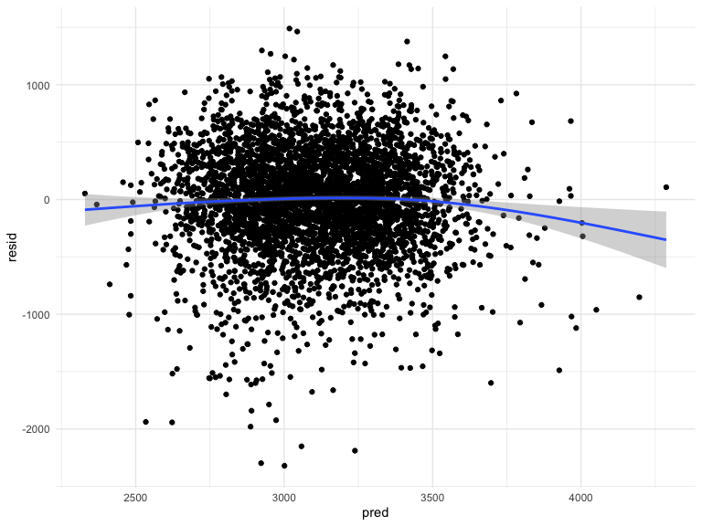
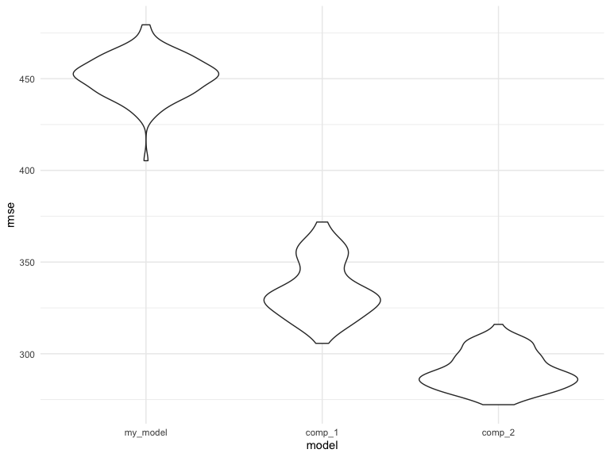

p8105\_hw6\_sl5009
================
Shengzhi Luo
03/12/2021

# Problem 1

## Load and clean the data

``` r
birthweight_df=
  read_csv("./birthweight.csv") %>% 
  mutate(
    babysex=case_when(
      babysex=="1" ~ "male",
      babysex=="2" ~ "female"
    ),
    frace=case_when(
      frace=="1" ~ "White",
      frace=="2" ~ "Black",
      frace=="3" ~ "Asian",
      frace=="4" ~ "Puerto Rican",
      frace=="8" ~ "Other",
      frace=="9" ~ "Unknown"
    ),
    malform=case_when(
      malform=="0" ~"absent",
      malform=="1" ~ "present"
    ),
    mrace=case_when(
      mrace=="1" ~ "White",
      mrace=="2" ~ "Black",
      mrace=="3" ~ "Asian",
      mrace=="4" ~ "Puerto Rican",
      mrace=="8" ~ "Other"
    ),
    babysex=fct_infreq(babysex)
  ) %>% 
  replace(is.na(.), 0) %>% 
  select(-pnumlbw,-pnumsga)
```

    ## Rows: 4342 Columns: 20

    ## ── Column specification ────────────────────────────────────────────────────────
    ## Delimiter: ","
    ## dbl (20): babysex, bhead, blength, bwt, delwt, fincome, frace, gaweeks, malf...

    ## 
    ## ℹ Use `spec()` to retrieve the full column specification for this data.
    ## ℹ Specify the column types or set `show_col_types = FALSE` to quiet this message.

We make babysex, frace, malform and mrace as factors and drop pnumlbw
and pnumsga column since they are all 0.

## Propose a regression model for birthweight.

``` r
fit_0 = lm(bwt ~ ., data = birthweight_df)
summary(fit_0)
```

    ## 
    ## Call:
    ## lm(formula = bwt ~ ., data = birthweight_df)
    ## 
    ## Residuals:
    ##      Min       1Q   Median       3Q      Max 
    ## -1097.68  -184.86    -3.33   173.09  2344.15 
    ## 
    ## Coefficients: (1 not defined because of singularities)
    ##                     Estimate Std. Error t value Pr(>|t|)    
    ## (Intercept)       -6335.5419   659.4669  -9.607  < 2e-16 ***
    ## babysexfemale        28.7073     8.4652   3.391 0.000702 ***
    ## bhead               130.7781     3.4523  37.881  < 2e-16 ***
    ## blength              74.9536     2.0217  37.075  < 2e-16 ***
    ## delwt                 4.1007     0.3948  10.386  < 2e-16 ***
    ## fincome               0.2898     0.1795   1.614 0.106551    
    ## fraceBlack           -6.9048    78.8349  -0.088 0.930210    
    ## fraceOther          -16.9392    97.5932  -0.174 0.862212    
    ## fracePuerto Rican   -68.2323    78.4692  -0.870 0.384599    
    ## fraceWhite          -21.2361    69.2960  -0.306 0.759273    
    ## gaweeks              11.5494     1.4654   7.882 4.06e-15 ***
    ## malformpresent        9.7650    70.6259   0.138 0.890039    
    ## menarche             -3.5508     2.8951  -1.226 0.220083    
    ## mheight               9.7874    10.3116   0.949 0.342588    
    ## momage                0.7593     1.2221   0.621 0.534418    
    ## mraceBlack          -60.0488    80.9532  -0.742 0.458266    
    ## mracePuerto Rican    34.9079    80.9481   0.431 0.666317    
    ## mraceWhite           91.3866    71.9190   1.271 0.203908    
    ## parity               95.5411    40.4793   2.360 0.018307 *  
    ## ppbmi                 4.3538    14.8913   0.292 0.770017    
    ## ppwt                 -3.4716     2.6121  -1.329 0.183913    
    ## smoken               -4.8544     0.5871  -8.269  < 2e-16 ***
    ## wtgain                    NA         NA      NA       NA    
    ## ---
    ## Signif. codes:  0 '***' 0.001 '**' 0.01 '*' 0.05 '.' 0.1 ' ' 1
    ## 
    ## Residual standard error: 272.5 on 4320 degrees of freedom
    ## Multiple R-squared:  0.7183, Adjusted R-squared:  0.717 
    ## F-statistic: 524.6 on 21 and 4320 DF,  p-value: < 2.2e-16

``` r
fit_1 = lm(bwt ~ delwt + menarche + mheight + momage + mrace + smoken + wtgain + parity, data = birthweight_df)
summary(fit_1)
```

    ## 
    ## Call:
    ## lm(formula = bwt ~ delwt + menarche + mheight + momage + mrace + 
    ##     smoken + wtgain + parity, data = birthweight_df)
    ## 
    ## Residuals:
    ##      Min       1Q   Median       3Q      Max 
    ## -2299.04  -254.35    20.92   298.27  1482.60 
    ## 
    ## Coefficients:
    ##                    Estimate Std. Error t value Pr(>|t|)    
    ## (Intercept)       1330.2347   191.8528   6.934 4.71e-12 ***
    ## delwt                4.3133     0.3863  11.166  < 2e-16 ***
    ## menarche            -4.8334     4.7805  -1.011 0.312036    
    ## mheight             17.2433     2.9589   5.828 6.03e-09 ***
    ## momage               4.1406     1.9672   2.105 0.035363 *  
    ## mraceBlack        -265.8683    71.3360  -3.727 0.000196 ***
    ## mracePuerto Rican  -67.2740    75.8915  -0.886 0.375425    
    ## mraceWhite          74.5246    70.6195   1.055 0.291348    
    ## smoken             -12.1372     0.9578 -12.672  < 2e-16 ***
    ## wtgain               7.7928     0.7086  10.997  < 2e-16 ***
    ## parity             -34.7375    66.7017  -0.521 0.602541    
    ## ---
    ## Signif. codes:  0 '***' 0.001 '**' 0.01 '*' 0.05 '.' 0.1 ' ' 1
    ## 
    ## Residual standard error: 451.2 on 4331 degrees of freedom
    ## Multiple R-squared:  0.2256, Adjusted R-squared:  0.2238 
    ## F-statistic: 126.2 on 10 and 4331 DF,  p-value: < 2.2e-16

``` r
fit_2 = lm(bwt ~ delwt + menarche + mheight + momage + mrace + smoken + wtgain, data = birthweight_df)
summary(fit_2)
```

    ## 
    ## Call:
    ## lm(formula = bwt ~ delwt + menarche + mheight + momage + mrace + 
    ##     smoken + wtgain, data = birthweight_df)
    ## 
    ## Residuals:
    ##      Min       1Q   Median       3Q      Max 
    ## -2299.26  -254.30    20.92   298.23  1482.57 
    ## 
    ## Coefficients:
    ##                    Estimate Std. Error t value Pr(>|t|)    
    ## (Intercept)       1330.6799   191.8348   6.937 4.61e-12 ***
    ## delwt                4.3156     0.3862  11.174  < 2e-16 ***
    ## menarche            -4.8575     4.7798  -1.016 0.309573    
    ## mheight             17.2650     2.9584   5.836 5.74e-09 ***
    ## momage               4.0779     1.9633   2.077 0.037859 *  
    ## mraceBlack        -266.5036    71.3195  -3.737 0.000189 ***
    ## mracePuerto Rican  -67.6563    75.8816  -0.892 0.372655    
    ## mraceWhite          74.1276    70.6095   1.050 0.293857    
    ## smoken             -12.1358     0.9577 -12.672  < 2e-16 ***
    ## wtgain               7.7847     0.7084  10.989  < 2e-16 ***
    ## ---
    ## Signif. codes:  0 '***' 0.001 '**' 0.01 '*' 0.05 '.' 0.1 ' ' 1
    ## 
    ## Residual standard error: 451.2 on 4332 degrees of freedom
    ## Multiple R-squared:  0.2256, Adjusted R-squared:  0.224 
    ## F-statistic: 140.2 on 9 and 4332 DF,  p-value: < 2.2e-16

We compare the full model with the plain model and then we drop the
factor “parity”.

## Make a plot

``` r
birthweight_df %>% 
  modelr::add_residuals(fit_2) %>% 
  modelr::add_predictions(fit_2) %>% 
  ggplot(aes(x = pred, y = resid)) +geom_point()+ geom_smooth()
```

    ## `geom_smooth()` using method = 'gam' and formula 'y ~ s(x, bs = "cs")'



``` r
  labs(x = "fitted values", y = "residuals")
```

    ## $x
    ## [1] "fitted values"
    ## 
    ## $y
    ## [1] "residuals"
    ## 
    ## attr(,"class")
    ## [1] "labels"

## Compare my model to two onthers.

``` r
cv_df = 
  crossv_mc(birthweight_df, 100) %>% 
  mutate(train = map(train, as_tibble),
         test = map(test, as_tibble)) %>% 
  mutate(
    my_model = map(train, ~lm(bwt ~ delwt + menarche + mheight + momage + mrace + smoken + wtgain, data = .x)),
    comp_1 = map(train,~lm(bwt ~ blength + gaweeks,data = .x)),
    comp_2 = map(train,~lm(bwt ~ bhead + blength + babysex 
                              + bhead*blength + bhead*babysex + blength*babysex 
                              + bhead*blength*babysex, data = .x))
  ) %>% 
  mutate(
    rmse_my_model = map2_dbl(my_model, test ,~rmse(model = .x,data = .y)),
    rmse_comp_1 = map2_dbl(comp_1, test ,~rmse(model = .x,data = .y)),
    rmse_comp_2 = map2_dbl(comp_2, test ,~rmse(model = .x,data = .y))
  )
```

``` r
cv_df %>% 
  select(starts_with("rmse")) %>% 
  pivot_longer(
    everything(),
    names_to = "model", 
    values_to = "rmse",
    names_prefix = "rmse_") %>% 
  mutate(model = fct_inorder(model)) %>% 
  ggplot(aes(x = model, y = rmse)) + geom_violin()
```



# Problem 2
